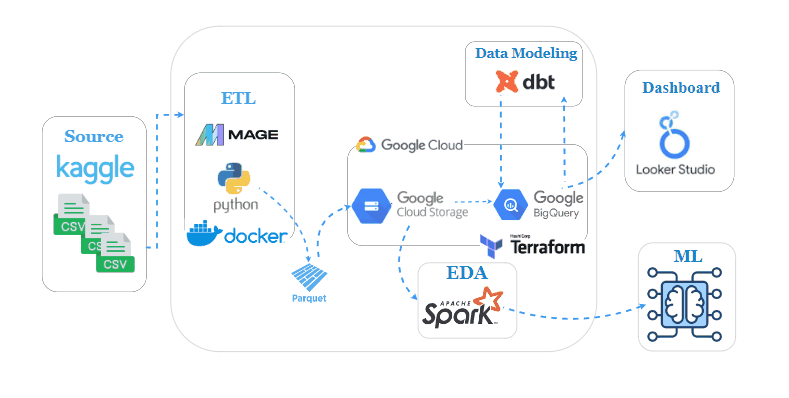
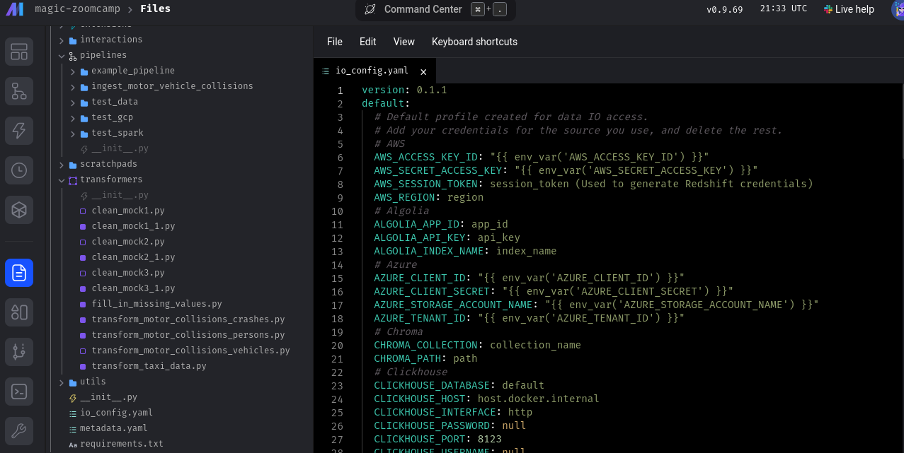
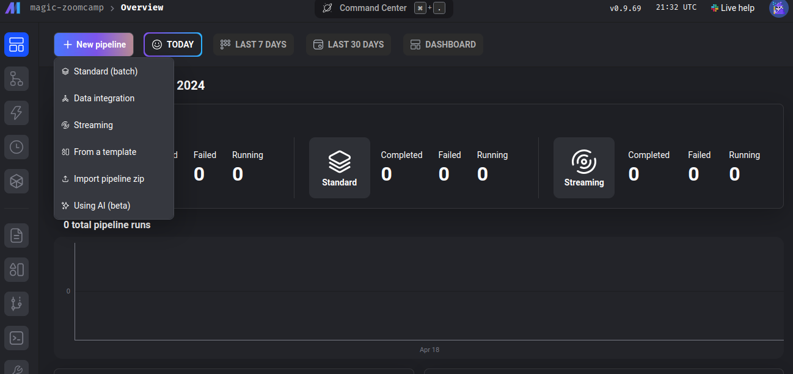
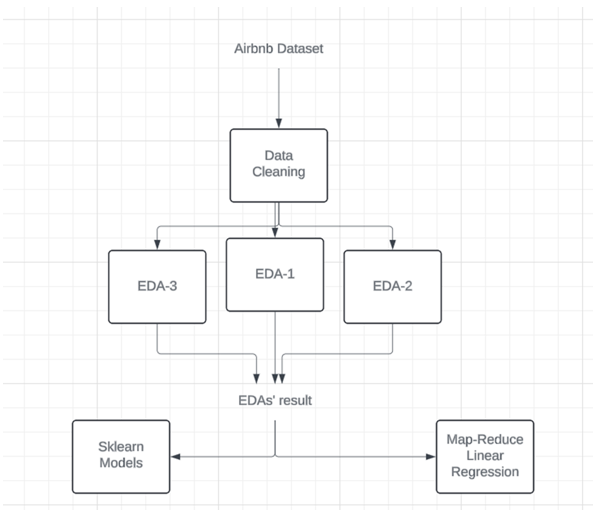

##  📖 Overview

We conduct comprehensive **Airbnb data analytics**, encompassing pricing dynamics, common features in listings, and business insights. Our analysis empowers hosts to optimize revenue by understanding key pricing factors and customer preferences, while assisting travelers in finding affordable listings with desired amenities.

## Data source 

The datasets for this project was obtained from **kaggle**.  we used the Airbnb dataset for Seattle and analyzed the listings in Seattle. The datasets can be obtained [here](https://www.kaggle.com/datasets/airbnb/seattle)

## Data Pipeline Architecture and Workflow 


The project can be divided into two sub-projects: the first is the **data engineering** project, which manages data flow, ETL orchestration, and data modeling. The second sub-project focuses on **data science**, conducting thorough exploratory data analysis (EDA) to delve into the data, extract relevant features, and implement appropriate machine learning models.


## Data Engineering flow Implementation 

#### MAGE

MAGE is used as data orchestration to implement  **ETL** operation on airbnb data  from kaggel load it to **Google** Cloud Storage and BigQuery

> Note : You can find more about the orchestration pipline in mage subdirectory

#### Terraform

We utilize Terraform in GCP to provision resources including Google Cloud Storage Buckets and BigQuery datasets for efficient data management and processing.

#### DBT

DBT platform is employed to conduct data modeling within BigQuery, facilitating the creation of dimension and fact tables for structured and optimized data organization.

> Note : You can find more about DBT data modeing pipline  pipline in dbt  subdirectory
#### Looker Studio

Looker Studio is utilized to craft insightful dashboards showcasing statistics derived from the fact tables built through DBT, enhancing data visualization and analysis capabilities.


### Installation

> To run the data flow   locally you should have the following prerequisites


- [Docker](https://docs.docker.com/get-docker/)
- [Docker Compose](https://docs.docker.com/compose/install/)
- [Google Cloud SDK](https://cloud.google.com/sdk)
- [Terraform](https://www.terraform.io)
- [MAGE](https://www.mage.ai/)
- [DBT](https://docs.getdbt.com/docs/cloud/about-cloud-setup)
- [Looker Studio](https://lookerstudio.google.com)


#### Create GCP resource

> You should have a billing account in GCP

1. Create a GCP project

2. Create a service account with the following rules
   1. `Big Query Admin`
   2. `Storage Admin`
   3. `Storage Object Admin`
   4. `Viewer`
3. Download the service account credentials file to your machine
4. clone this repository

```bash
   git clone https://github.com/MohamedHussein-X/Airbnb-Listings.git
```

5. open the repo with any IDE and create a keys folder

```bash
   mkdir keys
```

6. move the credentials file to the keys folder
7. update file `terraform/variable.tf` with your credentials file path and your GCP project ID move to the `terraform` directory and run the following command

```bash
   terraform init
   terraform apply
```

8. if all the previous steps work well you should have those resources created in your GCP project
   - GCP Bucket with the name `airbnb-listings-421017-bucket	`
   - BigQuery Dataset with the name `Airbnb_dataset`

> If you get an error in Terraform, you should check if you have `terraform` installed or `terraform` in your PATH.

#### Configure MAGE

1. clone the mage repository to your machine

```bash
   git clone https://github.com/mage-ai/mage-zoomcamp
```

2. configure your service account credentials file in mage by changing `<credential file path>` in the `docker-compose.yml` file in the mage repo that you clone with the actual path in your computer

```bash
 - <credential file path>:/home/src/personal-gcp.json
```

3. move to the mage repository and run the following command

```bash
docker-compose up -d
```

4. open this link `http://localhost:6789` in your browser
   > If you have an error with docker or docker-compose, ensure you install, docker, and docker-compose correctly and add them to your path
5. change the GCP configuration setting in mage in the `io_config.yml` file
   
   change this code

```yml
# Google
... additional lines
```

to this

```yml
# Google
GOOGLE_SERVICE_ACC_KEY_FILEPATH: "/home/src/personal-gcp.json"
GOOGLE_LOCATION: US # Optional
```

6. create a pipeline by uploading the zip file `mage_orchestration/airbnb_ETL.rar` to mage
   

7. run the pipeline, after all, pipeline blocks run you should have the `airbnb_listings.parquet` and `reviews_polarized.parquet` files in your GCP bucket, and the `airbnb_listings` and `reviews_polarized` tables in your BigQuery.


#### DBT

you can watch this video to understand how to create a DBT project with BigQueryConnection [dbt Cloud and BigQuery for Admins
](https://courses.getdbt.com/courses/dbt-cloud-and-bigquery-for-admins)

1. create a service account for the DBT Project with the following rules
   - `BigQuery Data Editor`
   - `BigQuery Job User`
   - `BigQuery Data Viewer`
2. download the service account key to your local machine
   > [!NOTE]
   > Before creating a dbt project fork this repo to your git hub and when creating a project choose the `dbt` folder from your fork as a subdirectory for your DBT project so you don't have to recreate models again.
3. create a DBT project with a BigQuery connection
4. run the following command in DBT Cloud IDE
   ```bash
   dbt run
   ```
5. if all steps go well all dimensions and fact tables should be created in your BigQuery dataset and you export them to Looker.


## Data Science flow Implementation
##### What factors and attributes contribute to the increased pricing of an Airbnb listing in Seattle?
This inquiry seeks to identify the key factors and distinguishing features contributing to the higher cost of Airbnb listings in Seattle. Our methodology encompasses **2** steps: 
1. Data preprocessing to ensure analytical relevance, conducting thorough Exploratory Analysis focusing on three key areas (**EDA**).
2. Applying Machine Learning techniques using **4** distinct Regression models to address our regression task.




### EDA
 we conducted Exploratory Analysis on the dataset, centering on three sub-problems:

1. Investigating the features, facilities, and amenities of properties that influence pricing.
2. Identifying specific areas in Seattle where Airbnb listings command higher prices.
3. Exploring the impact of textual data in property summaries and review sentiments on pricing.

> For more details about code , graphs and statistics . check the following files with  
> - Exploratory Analysis Problem 1.ipynb
> - Exploratory Analysis Problem 2.ipynb
> - Exploratory Analysis Problem 3.ipynb

### ML 

Regression Models that we used for listing price prediction are : 

1. Linear Regression
2. Random Forrest Regression
3. XGBoost
4. CatBoost

#### Evaluation of the various Machine Learning Models: 

| Model | Dataset | MAE  | MSE      | RMSE |
|---|---|---|---|---|
| Linear Regression (Map-Reduce) | Train | 43.2 | 4636.06 | 68.08 |
| | Test | 45.1 | 5115.1 | 71.5 |
| Linear Regression (sklearn) | Train | 37.4 | 3868.1 | 62.19 |
| | Test | 35.6 | 3177.5 | 56.3 |
| XGBoost | Train | 29.7 | 2373.8 | 48.7 |
|  | Test | 35.4 | 3329.4 | 57.7 |
| CatBoost | Train | 30.1 | 2412.6 | 49.1 |
|  | Test | 34.6 | 3304.5 | 57.4 |
| Random Forest| Train | 34.5 | 3334.6 | 57.7 |
| | Test | 34.9 | 3236.6 | 56.8 |

> For more details about ML models implementation  check ` ML-Molels.ipynb ` 


